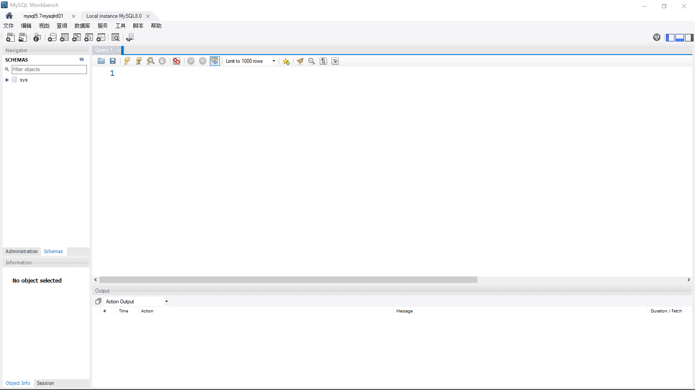
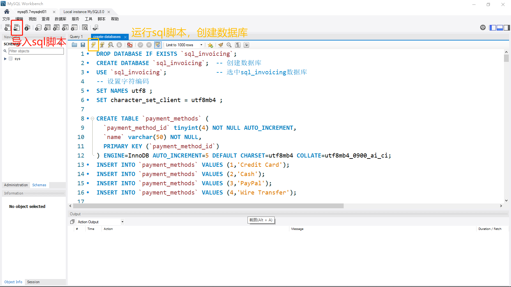
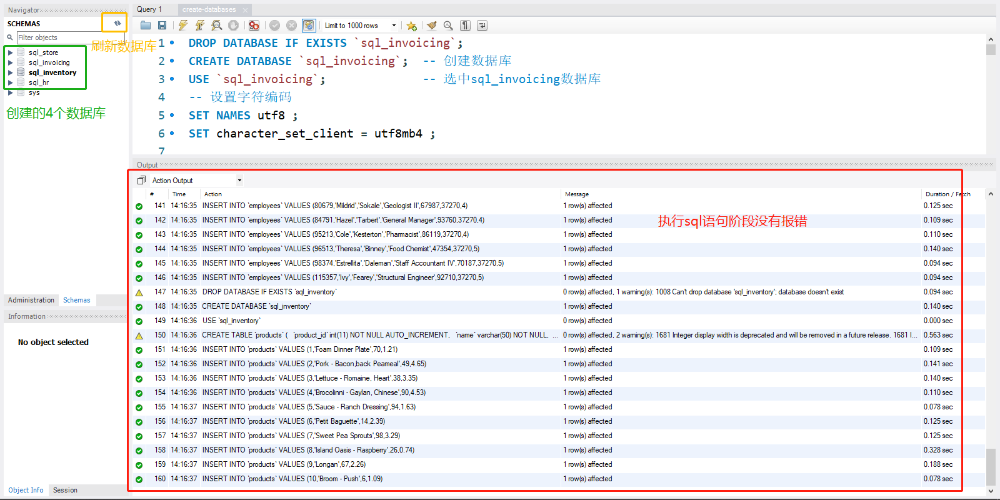
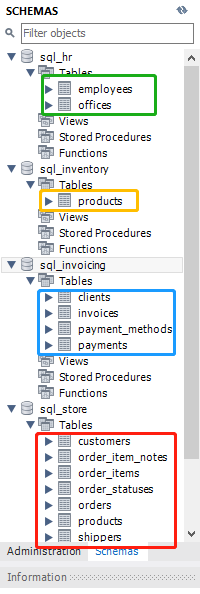
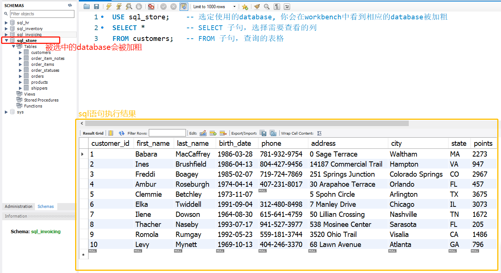
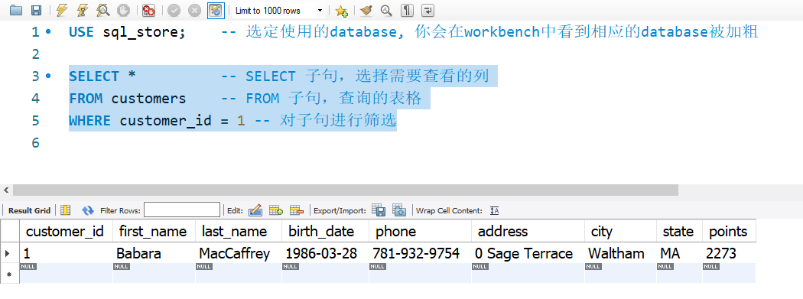
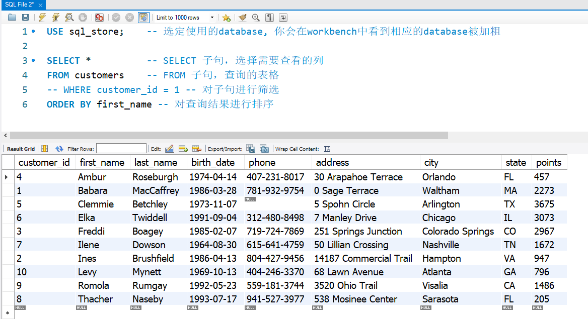
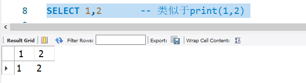
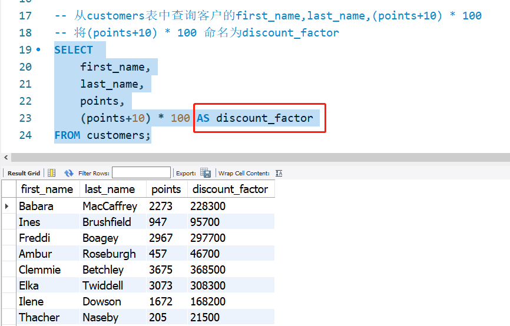

# 数据库的基本使用（增删改查）

## 一、基于sql脚本创建数据库
### 1.1. 打开并登录 数据库



- 本文基于 mysql5.7 和 workbench8.0
- 本人的workbench安装好后去找了汉化包`main_menu.xml`，去安装目录找到`main_menu.xml`文件，替换即可对菜单栏进行汉化。（本人安装目录：`D:\Program Files\MySQL\MySQL Workbench 8.0 CE\data`）

### 1.2. 创建数据库
打开workbench，“文件” - “打开sql脚本” - 点击“create-databases.sql”,然后执行文件就可以创建需要的数据库。


> **MySQL数据库中字符集与排序规则的默认配置**：
> MySQL5.6，MySQL5.7（latin1， latin1_swedish_ci）
> MySQL8.0（utf8mb4， utf8mb4_0900_ai_ci）
> 
> 在MySQL5.6，MySQL5.7中选择字符集为 utf8mb4 时，默认的排序规则是 utf8mb4_general_ci，而且可选择的排序规则中没有 utf8mb4_0900_ai_ci

```
CREATE TABLE `payment_methods` (
  `payment_method_id` tinyint(4) NOT NULL AUTO_INCREMENT,
  `name` varchar(50) NOT NULL,
  PRIMARY KEY (`payment_method_id`)
) ENGINE=InnoDB AUTO_INCREMENT=5 DEFAULT CHARSET=utf8mb4 COLLATE=utf8mb4_0900_ai_ci; 
```
- 如果你说mysql8.0, 字符集与排序规则设置为：`CHARSET=utf8mb4 COLLATE=utf8mb4_0900_ai_ci`
- 如果你说mysql5.6, 5.7  字符集与排序规则设置为：`CHARSET=utf8mb4 COLLATE=utf8mb4_general_ci`
- 如果两个数据库都用，则去掉排序规则指定：`CHARSET=utf8mb4`

如果你的sql脚本运行结果如下图所示，则说明 通过sql脚本创建数据库成功。

创建成功后，你会看到新增的4个数据库：
- sql_store
- sql_invoicing
- sql_inventory
- sql_hr

> 注意：tinyint(n),int(n) 这种 用法，会在以后的mysql版本中取消，建议直接使用 tinyint， int。

- 如果你刷新workbench之后还是没有显示上面创建的表格，建议重启workbench



## 二、数据库的基本用法

### 2.1 SELECT 语句
```sql
USE sql_store;    -- 选定使用的database, 你会在workbench中看到相应的database被加粗
SELECT *          -- SELECT 子句，选择需要查看的列
FROM customers;   -- FROM 子句，查询的表格
```


```sql
SELECT *          -- SELECT 子句，选择需要查看的列
FROM customers    -- FROM 子句，查询的表格
WHERE customer_id = 1 -- 对子句进行筛选
```


```sql
SELECT *          -- SELECT 子句，选择需要查看的列
FROM customers    -- FROM 子句，查询的表格
-- WHERE customer_id = 1 -- 对子句进行筛选
ORDER BY first_name -- 对查询结果进行排序
```


```sql
SELECT 1,2       -- 类似于print(1,2) 
```


> 在sql语法里，SELECT, FROM, WHERE, ORDER BY 的子句顺序是不能改变的。

### 2.2 SELECT 子句
```sql
-- 从customers表中查询客户的first_name,last_name
SELECT first_name,last_name  
FROM customers;
```

```sql
-- 从customers表中查询客户的first_name,last_name,points+10
SELECT first_name,last_name,points+10
FROM customers;
```

```sql
-- 从customers表中查询客户的first_name,last_name,(points+10) * 100
-- 将(points+10) * 100 命名为discount_factor
SELECT 
	first_name,
	last_name,
	points,
	(points+10) * 100 AS discount_factor
FROM customers;
```


```sql
-- 将(points+10) * 100 命名为discount factor(命名包含空格)
SELECT 
	first_name,
	last_name,
	points,
	(points+10) * 100 AS 'discount factor'
FROM customers;
```
```sql
-- DISTINCT 删除重复项，返回unique的结果
SELECT DISTINCT state
FROM customers;
```
#### 练习
从产品表products查询产品名称name, 单价unit price，新价格 单价\*1.1
```sql
-- Exercise
-- Return all the products
-- 	name
--  unit price
--  new price(unit price * 1.1)

SELECT 
	name, 
	unit_price, 
	unit_price * 1.1 AS 'new price'
FROM products;
```
### 2.2 WHERE 子句
```sql
-- WHERE 筛选 积分points大于3000的顾客
SELECT * 
FROM customers
WHERE points > 3000;
```
> **sql常见的逻辑运算符**:
> \> 	 大于
> \>=	大于或等于
> \<	 小于
> \<=	小于或等于
> \=	等于
> \!=	 不等于
> \<>	不等于

```sql
-- WHERE 筛选 州state为VA的顾客
SELECT * 
FROM customers
WHERE state = 'VA';
```

```sql
-- WHERE 筛选 1990年以后出生的人
SELECT * 
FROM customers
WHERE birth_date > '1990-01-01';
```
#### 练习
查看订单表order中今年(假设是2019年)下的订单
```sql
SELECT *
FROM orders
WHERE order_date >= '2019-01-01';
```

### 2.3 AND OR NOT 运算符

- AND 运算符
```sql
-- 查询1990年以后出生且积分大于1000的顾客信息
SELECT * 
FROM customers
WHERE birth_date > '1990-01-01'
	AND points > 1000;
```
- OR 运算符
```sql
-- 查询1990年以后出生，或者积分大于1000的顾客信息
SELECT * 
FROM customers
WHERE birth_date > '1990-01-01'
	OR points > 1000;
```
> 运算符优先级：
> AND > OR > NOT
```sql
-- 查询1990年以后出生，或者积分大于1000且state为VA的顾客信息
SELECT * 
FROM customers
WHERE birth_date > '1990-01-01'
	OR points > 1000
    AND state = 'VA';
-- 下面执行的结果相同    
SELECT * 
FROM customers
WHERE birth_date > '1990-01-01'
	OR 
    (points > 1000 AND state = 'VA');
```

- NOT 运算符
```sql
-- 查询既不是1990年以后出生，也不是积分大于1000的顾客的信息
SELECT * 
FROM customers
WHERE NOT (birth_date > '1990-01-01' OR 
		   points > 1000);
            
-- 等价于
SELECT * 
FROM customers
WHERE birth_date <= '1990-01-01' AND 
	  points <= 1000;
```
#### 练习
- 查询order_items表，查询订单号为6，且order总价大于30的信息
- 总价 = 单价 \* 数量

```sql
-- From the order_items tables,get the items
-- 	for order # 6
-- 	where the total price is greater than 30
SELECT *
FROM order_items
WHERE order_id = 6 AND quantity*unit_price > 30;
```

### 2.4 IN 运算符
- IN 运算符
```sql
-- 从customers表中，查询位于Virginia或者位于Florida或者位于Georgia的顾客的信息
SELECT * 
FROM customers
WHERE state = 'VA' 
   OR state = 'FL' 
   OR state = 'GA';
   
-- 等价于
SELECT * 
FROM customers
WHERE state IN ('VA','FL','GA');
```
#### 练习
- 从products表查询现货库存数量为 49，38，72的产品信息
```sql
-- Return products with
-- 	quantity in stock equal to 49, 38, 72
SELECT * 
FROM products
WHERE quantity_in_stock IN (49, 38, 72);
```
### 2.5 BETWEEN 运算符
- BETWEEN 运算符
```sql
-- 从customers表查询积分在1000~3000的顾客的信息
SELECT *  
FROM customers
WHERE points BETWEEN 1000 AND 3000;

-- 等价于
SELECT *  
FROM customers
WHERE points >= 1000 
  AND points <=3000;
```
#### 练习
- 从customers表查询1990年1月1日到2000年1月1日期间出生的顾客的信息
```sql
-- Return customers born
-- 		between 1/1/1990 and 1/1/2000
SELECT *  
FROM customers
WHERE birth_date BETWEEN '1990-01-01' AND '2000-01-01';
```
### 2.6 LIKE 运算符
- LIKE 运算符： 用于模糊查询
- 百分号 % 匹配一个或多个字符
位于开头
```sql
-- 查询以B为首字母的姓氏的顾客的信息
SELECT * 
FROM customers
WHERE last_name LIKE 'b%';
```
不限定位置
```sql
-- 查询以包含B字母的姓氏的顾客的信息
SELECT * 
FROM customers
WHERE last_name LIKE '%b%';
```
-  单下划线 \_ 匹配一个字符
```sql
-- 查询以y字母结尾且总共为6个字母的姓氏的顾客的信息
SELECT * 
FROM customers
WHERE last_name LIKE '_____y'; -- 5个"_"
```
> 常见的通配符：
> **%**： 一个或多个字符
> **\_**：  单个字符

#### 练习
- 1.查询地址里包含”trail“ 或者 ”avenue“的顾客的信息  
- 2.查询电话号码以9结尾的顾客的信息

```sql
-- Get the customers whose
-- 	addresses contain TRAIL or AVENUE
SELECT *
FROM customers
where address like '%trail%' 
   OR address like '%avenue%';
   
-- 	phone numbers end with 9
SELECT *
FROM customers
where phone like '%9';
```
### 2.7 REGEXP 运算符
- REGEXP: reguler expression 正则表达式
```sql
-- 查询姓氏中包含field的顾客的信息
SELECT * 
FROM customers
WHERE last_name LIKE '%field%';
-- 等价于
SELECT * 
FROM customers
WHERE last_name REGEXP 'field';
```
- | 表示多个匹配模式, |两边不能有空格，因为空格也算一个特殊字符
```sql
-- 查询姓氏中包含field或者mac的顾客的信息
SELECT * 
FROM customers
WHERE last_name REGEXP 'field|mac';
```
- $ 表示匹配结尾字符
- ^ 表示匹配开头字符
```sql
-- 查询姓氏中以field结尾或者包含mac或者包含rose的顾客的信息
SELECT * 
FROM customers
WHERE last_name REGEXP 'field$|^mac|rose';
```
- [] 表示括号内任意一个字符匹配即可
```SQL
-- 查询姓氏中包含ge或者ie或者me的顾客的信息
SELECT * 
FROM customers
WHERE last_name REGEXP '[gim]e';
```
```sql
-- [a-h] 等价于 [abcdefgh]
SELECT * 
FROM customers
WHERE last_name REGEXP '[a-h]e';
```
> REGEXP 中的通配符：
>  ^ : begging
>  $ : end
>  |  : logical or
>  [abcd]  : one of a,b,c,d
>  [a-f]  : one of a,b,c,d,e,f

#### 练习
```sql
-- Exercise
-- Get the customers whose
-- 		1.first names are ELKA or AMBUR
-- 		2.last names end with EY or ON
-- 		3.last names start with MY or contains SE
-- 		4.last names contan B followed by R or U

-- 1.first names are ELKA or AMBUR
SELECT *
FROM customers
WHERE first_name REGEXP 'ELKA|AMBUR';
-- 2.last names end with EY or ON
SELECT *
FROM customers
WHERE last_name REGEXP 'ey$|on$';
-- 3.last names start with MY or contains SE
SELECT *
FROM customers
WHERE last_name REGEXP '^my|se';
-- 4.last names contan B followed by R or U
SELECT *
FROM customers
WHERE last_name REGEXP 'b[ru]';
```
### 2.8 IS NULL 运算符
- IS NULL 运算符
```SQL
-- 查询phone number 为空的行
SELECT * 
FROM customers
WHERE phone IS NULL;

-- 查询phone number 非空的行
SELECT * 
FROM customers
WHERE phone IS NOT NULL;
```
#### 练习
- 查询还没有发货的订单
```SQL
-- Get the orders that are not shipped
SELECT * 
FROM orders
WHERE shipped_date IS NULL;
```
### 2.9 ORDER BY 子句
- ORDER BY 子句， 依据某一字段排序
- ASC 升序（默认）；DESC 降序
```sql
-- 查询顾客信息，并通过名字升序排序
SELECT * 
FROM customers
ORDER BY first_name;
-- 查询顾客信息，并通过名字降序排序
SELECT * 
FROM customers
ORDER BY first_name DESC;
```
-- 多字段排序
```sql
-- 查询顾客信息，先通过州升序排序，再通过名字升序排序
SELECT * 
FROM customers
ORDER BY state, first_name;
```
#### 练习
```sql
-- 查询 order_items 表格，
-- 		订单号为2
-- 		且按照总价格降序

-- 1. 订单号为2
SELECT * 
FROM order_items
WHERE order_id = 2
-- 2. 按照总价格降序
SELECT * 
FROM order_items
ORDER BY quantity * unit_price DESC
-- 合并两个条件：订单号为2，且按照总价格降序
SELECT * 
FROM order_items
WHERE order_id = 2
ORDER BY quantity * unit_price DESC
```
也可以这样查询：
```sql
-- 新增一列total price
SELECT * ,quantity * unit_price AS total_price
FROM order_items
WHERE order_id = 2
ORDER BY total_price DESC;
```
### 2.10 LIMIT 子句
- LIMIT 子句， 指定返回数据条数
```sql
-- 查看前3名顾客
SELECT * 
FROM customers
LIMIT 3;
```
- 指定偏移量
- 1.当 limit后面跟一个参数的时候，该参数表示要取的数据的数量
`LIMIT 选择行数`
- 2.当limit后面跟两个参数的时候，第一个数表示要跳过的数量，后一位表示要取的数量
`LIMIT 偏移量，选择行数`
- 3.当 limit和offset组合使用的时候，limit后面只能有一个参数，表示要取的的数量,offset表示要跳过的数量
`LIMIT 选择行数 OFFSET 偏移量`
```sql
-- set offset
-- 这个在分页场景中经常使用
-- page 1: 1-3
-- page 2: 4-6
-- page 3: 7-9 *
-- 假设现在在page 2, 查询page 3
-- 即 查询7，8，9三行
SELECT * 
FROM customers
LIMIT 6, 3;
```
#### 练习
- 获取最忠诚是3名顾客，即积分最多的前三名顾客
```SQL
-- Get the top three loyal customers
SELECT *
FROM customers
ORDER BY points DESC
LIMIT 3;
```