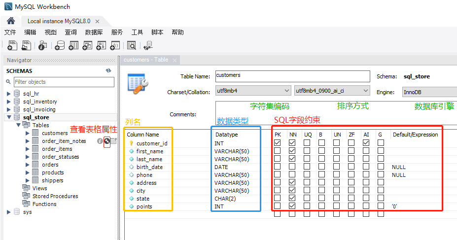

# 第四章 数据库表格的插入，更新和删除


### 4.1 列属性
在wokbench里面可以查看数据表的表格属性，主要包括列名，数据类型，以及sql字段约束。



- sql约束
主键约束：primary key
非空约束：not null
唯一约束：unique
外键约束：foreign key

### 4.2 插入单行
```sql
-- INSERT one row
INSERT INTO customers
VALUES 
	(DEFAULT, 'Join','Smith','1990-01-01',DEFAULT,'address','city','CA',DEFAULT);
-- 等价于
INSERT INTO customers(
	first_name, last_name,birth_date,address,city,state
)
VALUES 
	('Join','Smith','1990-01-01','address','city','CA');
```

### 4.3 插入多行
```sql
-- INSERT MYLTI-ROWS
INSERT INTO shippers (name)
VALUES
	('Shipper1'),
    ('Shipper2'),
    ('Shipper3');
```
#### 练习
```sql
-- Exercise
-- Insert three rows in the products table
INSERT INTO products (name, quantity_in_stock, unit_price)
VALUES
	('Product1',10,1.95),
    ('Product2',11,1.95),
    ('Product3',12,1.95);
```
### 4.4 插入分层行
- 这个我也没看懂
```sql
-- 插入分层表
INSERT INTO orders (customer_id, order_date,status)
VALUES (1, '2019-01-02', 1);

-- SELECT LAST_INSERT_ID()：
-- 得到刚 insert 到orders记录的主键值order_id，只适用与自增主键
INSERT INTO order_items
VALUES
	(LAST_INSERT_ID(), 1, 1, 2.35),
    (LAST_INSERT_ID(), 2, 1, 3.95),
    (LAST_INSERT_ID(), 3, 1, 2.35);
```
### 4.5 插入表复制
- 从一张表复制数据到另外一张表
```sql
-- 将orders表复制一份为orders存档
-- CREATE TABLE ... AS ...
CREATE TABLE orders_archived AS
SELECT * FROM orders;

-- 还可以向已有的表格添加数据
-- 先清空表数据
TRUNCATE TABLE orders_archived;
-- 插入2019年以前的订单信息
INSERT INTO orders_archived
SELECT * 
FROM orders
WHERE order_date < '2019-01-01';
```
#### 练习
```sql
-- sql invoicing数据库中的发票表，
-- 创建invoices archived 表，存入 invoices中的部分记录
-- 要求：
-- 1.替换invoices中的client_id 为client_name（client.name）
-- 2.只筛选 已经支付过（payment_date）的发票信息
CREATE TABLE invoices_archived AS
SELECT 
	i.invoice_id,
    i.number,
    c.name AS client,
    i.invoice_total,
    i.payment_total,
    i.invoice_date,
    i.payment_date,
    i.due_date
FROM invoices i 
LEFT JOIN clients c
USING (client_id)
WHERE i.payment_date IS NOT NULL;
```
### 4.6 更新单行
```sql
-- INSERT ONE ROW
UPDATE invoices
SET payment_total = 0, payment_date = NULL
WHERE invoice_id = 1;

UPDATE invoices
SET 
	payment_total = invoice_total * 0.5, 
	payment_date = due_date
WHERE invoice_id = 3;
```
### 4.7 更新多行
```sql
-- INSERT Multi-ROWs
-- 更新所有client_id = 3的客户的信息
UPDATE invoices
SET 
	payment_total = invoice_total * 0.75, 
	payment_date = due_date
WHERE client_id = 3;
-- 5 row(s) affected, 5 warning(s): 
-- 1265 Data truncated for column 'payment_total' at row 1 1265 Data truncated for column 'payment_total' 
-- at row 2 1265 Data truncated for column 'payment_total' at row 3 1265 Data truncated for column 'payment_total' 
-- at row 4 1265 Data truncated for column 'payment_total' at row 5 Rows matched: 5  Changed: 5  Warnings: 5	0.094 sec

-- 也可以使用IN关键字，更新所有client_id = 3 和 4的客户的信息
UPDATE invoices
SET 
	payment_total = invoice_total * 0.8, 
	payment_date = due_date
WHERE client_id IN (3,4);
```
#### 练习
```sql
-- Exercise
-- Write a SQL statement to
-- 		give any customers born before 1990
-- 		50 extra points
-- 1.select: birth_date < '1990-01-01'
SELECT points + 50
FROM customers
WHERE birth_date < '1990-01-01';
-- 2. update: points = points + 50
UPDATE customers
SET points = points + 50
WHERE birth_date < '1990-01-01';
-- 11:55:54	UPDATE customers SET points = points + 50 WHERE birth_date < '1990-01-01'	
-- 7 row(s) affected Rows matched: 7  Changed: 7  Warnings: 0	0.078 sec
```
### 4.8 在UPDATE种用子查询
```sql
-- UPDATE USING SUBQUERIRS
UPDATE invoices
SET 
	payment_total = invoice_total * 0.88, 
	payment_date = due_date
WHERE client_id =
(SELECT client_id
FROM clients
WHERE name = 'Myworks');
```
#### 练习
```SQL
-- UPDATE orders table
-- 为积分超过3000的顾客更新订单里的注释信息
-- 1. select customer whose points > 3000
SELECT customer_id 
FROM customers
WHERE points > 3000
-- 2. update comments from orders table
UPDATE orders
SET comments = 'Golden'
WHERE customer_id IN(
	SELECT customer_id 
	FROM customers
	WHERE points > 3000
);
```
### 4.9 删除行
```sql
-- DELETE ONE ROW
-- 删除客户名称为'Myworks'的发票信息
-- 1. 查询客户名称为'Myworks'的发票信息
SELECT * FROM invoices
WHERE client_id = (
	SELECT client_id 
	FROM clients
	WHERE name = 'Myworks'
);
-- 2. 删除刚刚查询到的信息
DELETE FROM invoices
WHERE client_id = (
	SELECT client_id 
	FROM clients
	WHERE name = 'Myworks'
)
-- 你再次执行第一步的查询就无法查到信息了
```
### 4.10 恢复数据库
- 重新执行一遍`create-datebases.sql`脚本即可